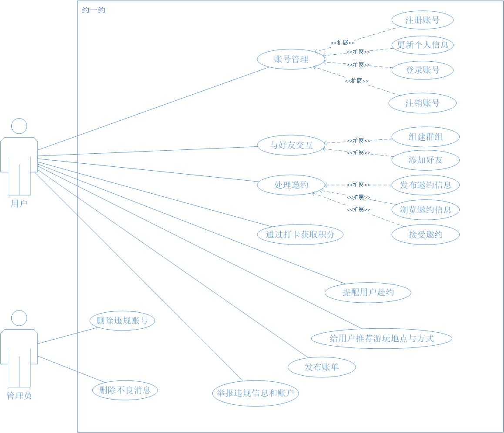
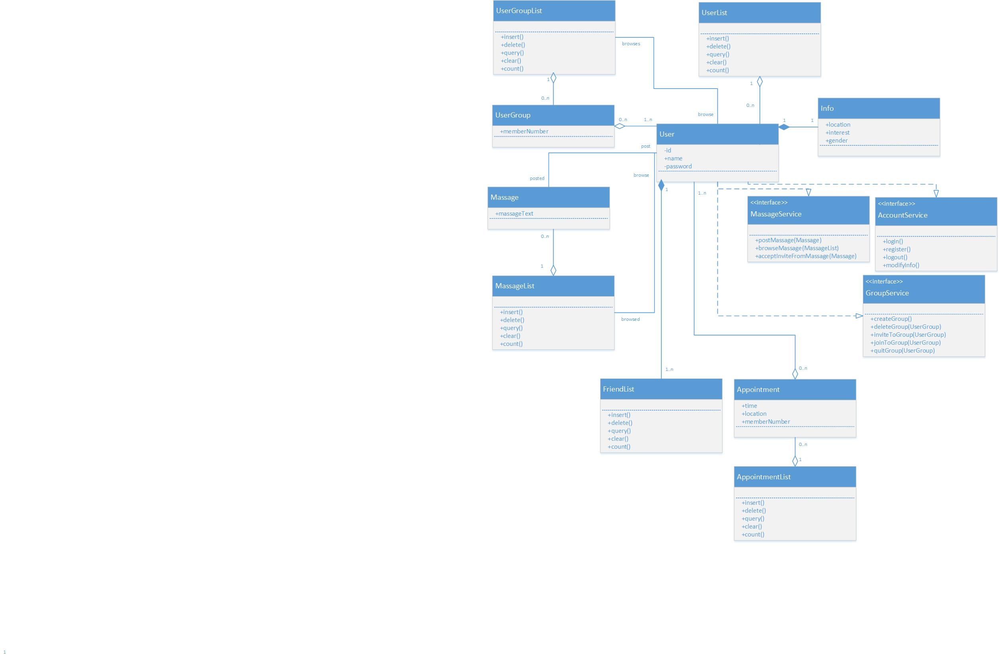
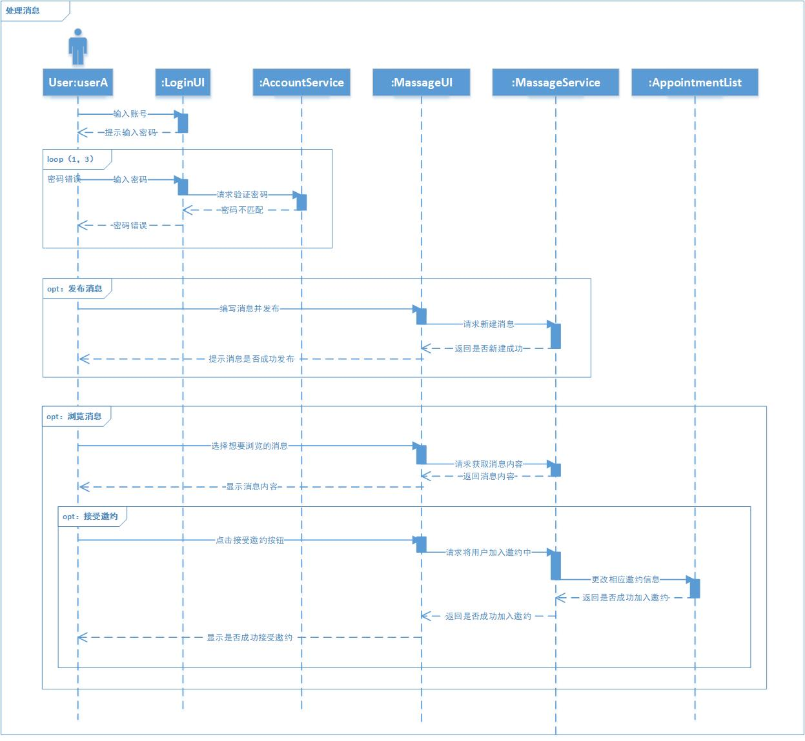

## 用例图

## 类图

### 类图部分说明

- 类图没有实现软件的全部功能，只是将部分核心功能展示出来。

- 如用户登录模块、消息模块、好友与群组模块。

####	User类：

- 用于储存用户账户信息。

#### UserGroup类：

- 指的是用户群组，类似于微信的群组，与用户是聚合关系。

#### UserGroupList类：

- 是用户群组的集合，与用户群组是聚合关系。
- 与用户有着关联关系，用户可以浏览他的用户群组列表，群组列表可以被用户浏览。

#### Info类：

- 储存用户信息，例如地理位置，兴趣爱好等，与用户是组合关系。

#### Massage类：

- 该类不是传统意义上的消息，而是类似于朋友圈。
- 与用户有关联关系，用户可以发布消息，消息可以被用户发布。

#### MassageList类：

- 与消息类是聚合关系。
- 与用户有关联关系，用户可以浏览消息列表，消息列表可以被用户浏览。

#### FriendList类： 

- 用于储存用户的好友列表，与用户是一个组合关系。
- 一个用户可以有多个好友列表用于分类好友。

#### Appointment类：

- 约定类是用户在消息中接受邀约后产生的。
- 与用户是一个聚合关系，多个用户接受同一个邀约就会修改Appointment对象的内容。

#### AppointmentList类：

- 该类是Appointment类的集合。是聚合关系

#### XxxList类：

- 所有的List类有同样的方法，增删改查，可以实现同一个接口。由于类图比较大，增删改查接口画上去会很乱，所以没画。

#### MassageService接口：

- 用户处理消息的功能，如发布、浏览消息，接受消息中的邀约等。

#### AccountService接口：

- 用户账户处理的方法，如登录，注册，登出，修改信息等。

#### GroupService接口：

- 用户操作用户群组的方法。如创建群组，删除群组，邀请他人加入，申请加入群组，退出群组等。

## 时序图

- 时序图展示消息模块的功能。
- 用户要处理消息，需要先登录。
- 登陆后用户可以选择发布消息或浏览消息。
- 浏览消息可以选择是否接受邀约。

