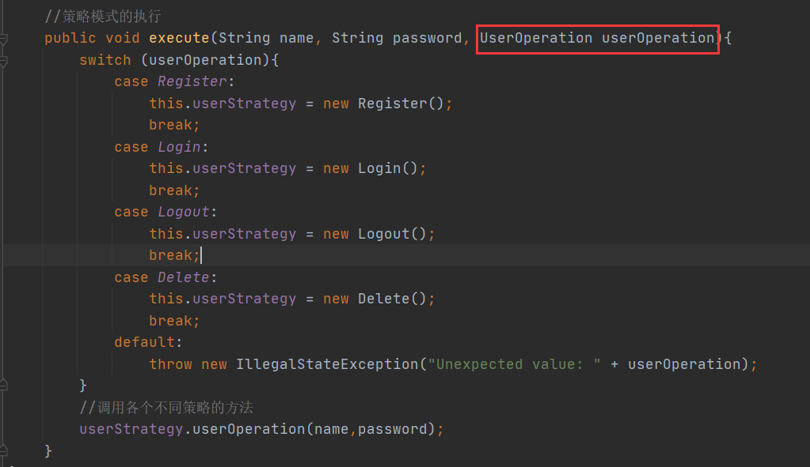
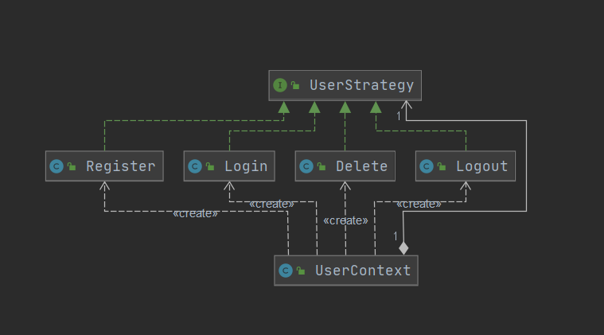
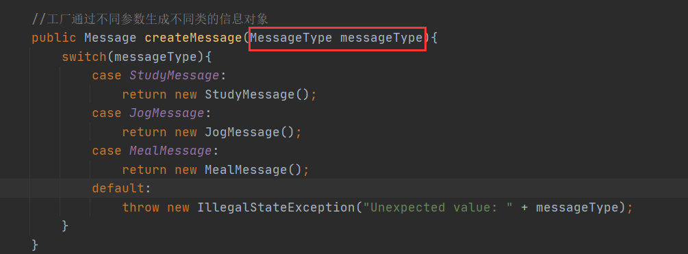
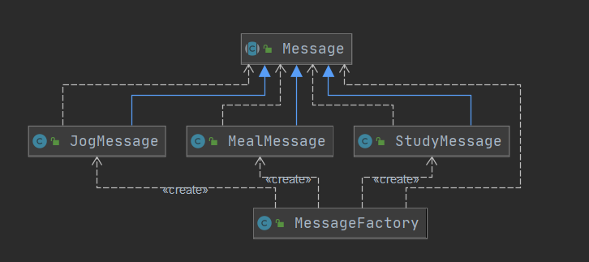
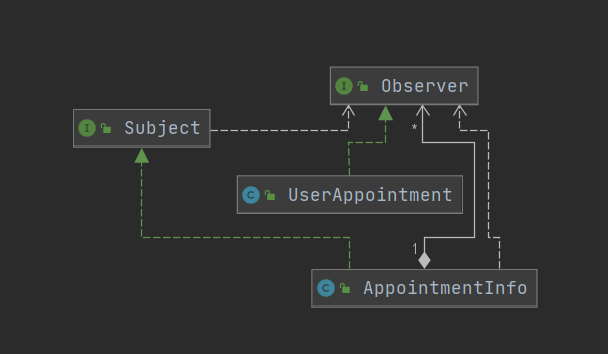
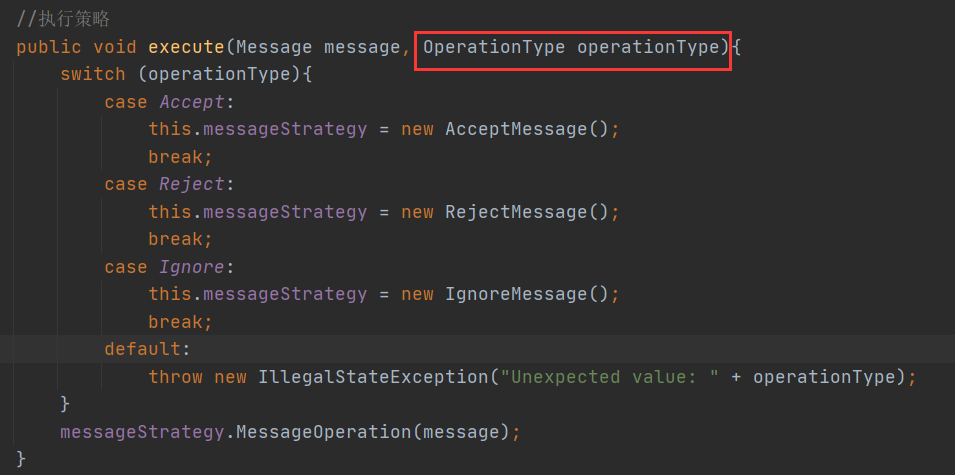
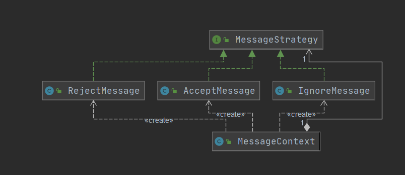

本次实验实现了我们项目中**用户模块**和**信息平台**模块

## 用户模块

### 策略模式

​        用户模块主要是实现用户的注册、登录、登出、删除账户的功能。由于这些功能都是基于用户的操作，因此可以采用策略模式，声明一个策略接口，并分别用不同的实现类实现这个接口。

​        这样客户端调用的时候不用关心调用函数的内部细节，只需要在调用接口时将要调用的方法作为函数传入。

#### 结构

**UserStrategy**声明了一个接口，四个实现类（**Register、Login、Delete、Logout**）分别实现这个接口，在**UserContext**中将**UserStrategy**的接口对客户端隐藏起来，客户端只要调用**UserContext**暴露的接口就行。

#### 策略模式的优势

- 策略模式将每个接口的细节对客户端隐蔽起来，客户端只要调用同一个接口，传入不同的参数，就可以实现不同的功能。

- 策略模式方便程序进行拓展。如果新增了一个功能，只需要重新写一个实现类，就可以完成对程序的拓展
- 此处的策略模式可以使用MVC模式代替

## 信息平台

### 简单工厂模式

​        信息平台需要信息的发布。信息有不同的类型。产生不同类型的信息时，就可以使用简单工厂模式。

​        这样客户端就不用关心不同信息产生时的细节，只需要调用同一个接口传入不同参数就可以了。

#### 结构

**Message**是抽象类，**JogMeaasge、MealMessage、StudyMessage**是具体类，**MessageFactory**是信息工厂。

#### 工厂模式的优势

- 工厂模式将产生对象的细节对客户端隐蔽起来，客户端只要调用同一个接口，传入不同的参数，工厂就可以自动产生不同的对象。

- 可拓展性强，新增信息类型只需要重新写一个信息类。

### 观察者模式

​        每次有人加入一个新的约饭或者约学习的任务时，系统会将有新人加入的信息通知其他人。此时就可以利用观察者模式。每个用户在邀约中注册为观察者，每有一个新用户加入就通知其他观察者，并将新加入的用户也设置为观察者。

#### 结构

**UserAppointment**是具体观察目标，**Subject**是抽象目标，**Appointment**是具体观察者，**Object**是抽象观察者。

#### 观察者模式优势

- 新增观察者时不必改变代码。
- 将客户端使用时只需调用观察者模式系统暴露的接口，将子系统与客户端进行解耦。
- 内部的修改不会影响到外部的系统。

### 策略模式

​       用户浏览信息之后需要对信息进行操作，比如接受邀约，拒绝邀约，忽略邀约。这时就可以使用策略模式，对外暴露统一的接口。

#### 结构

**MessageStrategy**声明了一个接口，三个实现类（**RejectMessage、AcceptMessage、IgnoreMessage**）分别实现这个接口，在**MessageContext**中将**MessageStrategy**的接口对客户端隐藏起来，客户端只要调用**MessageContext**暴露的接口就行。

#### 策略模式优势

​         之前分析过了。
