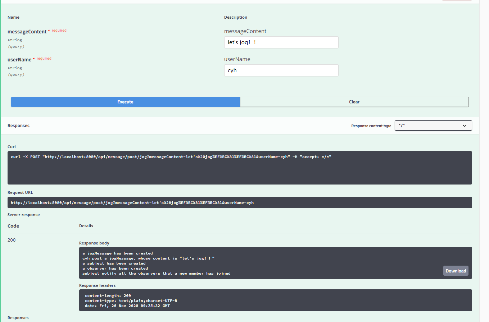

### 实现方式

使用springboot+swaggerUI 的方式，实现restfulAPI

#### maven依赖

~~~xml
    <dependency>
        <groupId>io.springfox</groupId>
        <artifactId>springfox-swagger2</artifactId>
        <version>2.9.2</version>
    </dependency>

    <dependency>
        <groupId>io.springfox</groupId>
        <artifactId>springfox-swagger-ui</artifactId>
        <version>2.9.2</version>
    </dependency>

    <dependency>
        <groupId>org.springframework.boot</groupId>
        <artifactId>spring-boot-starter-web</artifactId>
        <version>2.1.9.RELEASE</version>
    </dependency>

    <dependency>
        <groupId>org.springframework.boot</groupId>
        <artifactId>spring-boot-starter-test</artifactId>
        <version>2.1.9.RELEASE</version>
        <scope>test</scope>
    </dependency>
~~~

#### swagger配置

~~~ java
@Configuration
@EnableSwagger2
@ComponentScan("com.WHUDateOneDate.Controller")
public class SwaggerConfig {
    @Bean
    public Docket createRestApi() {
        return new Docket(DocumentationType.SWAGGER_2)
                .apiInfo(apiInfo())
                .select()
                .apis(RequestHandlerSelectors.basePackage("com.WHUDateOneDate.Controller"))
                .paths(PathSelectors.any())
                .build();
    }

    private ApiInfo apiInfo() {
        return new ApiInfoBuilder()
                .title("WHUDateOneDate")
                .description("WHUDateOneDate 武大约一约")
                .contact(new Contact("cyh", "https://github.com/lctaba", "1169858807@qq.com"))
                .termsOfServiceUrl("https://github.com/lctaba/WHUDateOneDate")
                .version("1.0.0")
                .build();
    }
}
~~~

#### 某个API的实现

~~~ java
    @ApiOperation(
            value = "用户注册",
            notes = "用户注册"
    )
    @RequestMapping(
            value = "/Register",
            method = RequestMethod.POST
    )
    public String registerAccount(@RequestParam(value = "userName") String userName,
                              @RequestParam(value = "password") String password)
    {
        userContext.execute(userName,password,UserContext.UserOperation.Register);
        return userName + " register successfully";
    }
~~~

### 实现的功能

#### 邀约信息的各种操作

- 发布信息
  - 约饭信息
  - 约跑步信息
  - 约学习信息
- 浏览信息
- 忽略信息
- 接受信息中的邀约
- 拒绝信息中的邀约

#### 账户模块

- 注册
- 登录
- 登出
- 删除

### 实现效果

启动springboot项目，打开http://localhost:8080/swagger-ui.html#/

#### 发布跑步信息

#### 接受邀约

#### 忽略信息

#### 拒绝邀约

#### 账户注册

#### 账户删除

#### 账户登录

#### 用户登出

